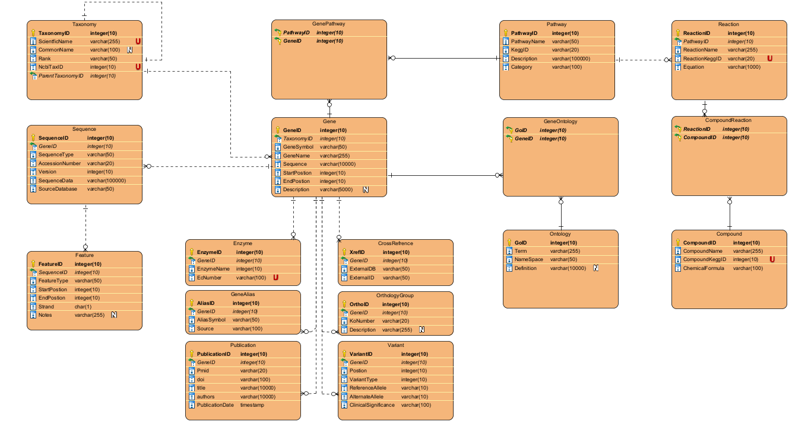

# 🧬 Gene Bank Relational Database

A **PostgreSQL 15** implementation of a relational schema for managing gene-related data. This database consolidates taxonomy, gene annotations, pathways, reactions, compounds, ontologies, and literature metadata—drawing inspiration from resources like **NCBI Gene** and **KEGG**.

| [](Docs/ERD_Diagram.png) |
|:--:|
| *Figure 1 – Full entity–relationship diagram (click to enlarge).* |

---

## 1. Why this project?
Modern bioinformatics workflows often rely on scattered flat files (GBK, FASTA, GFF3), pathway records (KGML, SBML), and JSON/OBO ontologies, making querying and integration difficult.

This project provides a **normalized SQL schema** designed to:
* Simplify **complex JOINs** across genes, pathways, and annotations.
* Maintain **data integrity** using constraints, indexes, and relationships.
* Enable **fast queries** and reporting with optimized SQL and transactions.
* Provide a foundation for **ETL pipelines**, APIs, or dashboards.

---

## 2. What’s included?
- **Schema Definitions:** SQL scripts for tables, primary/foreign keys, and constraints.
- **Indexes & Optimizations:** Indexes for fast lookups on common query paths.
- **Queries:** Example SQL queries for analytical use-cases.
- **Sample Data:** Insert scripts to test and demonstrate functionality.
- **Procedures & Transactions:** Stored procedures, triggers, and transaction examples.

---

## 3. Schema Overview

| Core Table             | Purpose (Key Columns)                                                     |
|------------------------|--------------------------------------------------------------------------|
| `Taxonomy`             | NCBI-style lineage (`TaxonomyID`, `ParentTaxonomyID`, `Rank`, `Name`)     |
| `Gene`                 | One row per locus (`GeneID`, `TaxonomyID`, `GeneSymbol`, `Sequence`)      |
| `Pathway`              | Pathway information (`PathwayID`, `Name`, `Description`)                  |
| `GenePathway`          | M:N linker table between genes and pathways                              |
| `Compound`, `Reaction` | Reactions and related compounds                                           |
| `Ontology`             | GO terms and controlled vocabularies                                      |
| `Publication`          | Metadata and references to literature                                    |

> For all PK/FK relationships, refer to **Docs/ERD.png**.

---

## 4. Tech Stack
- **Database:** PostgreSQL 15
- **Schema & Migrations:** `psql`, `pg_dump`
- **Procedures & Transactions:** PL/pgSQL scripts
- **Sample Data:** SQL insert scripts
- **Optional ETL:** Python ≥3.10 (for loading and cleaning data)

---

## 5. Getting Started

1. **Clone this repository:**
   ```bash
   git clone https://github.com/yourusername/gene-bank-relational-db.git
   cd gene-bank-relational-db
   ```

2. **Create the database:**
   ```bash
   createdb gene_bank
   psql -d gene_bank -f schema/tables.sql
   psql -d gene_bank -f schema/constraints.sql
   psql -d gene_bank -f schema/indexes.sql
   psql -d gene_bank -f schema/sample_data.sql
   ```

3. **Run procedures and transactions:**
   ```bash
   psql -d gene_bank -f procedures/transactions.sql
   ```

---

## 6. Future Improvements
- Add real datasets (e.g., KEGG, Ensembl).
- Implement REST API endpoints.
- Add advanced triggers and audit logs.
- Create Power BI dashboards or Jupyter-based analysis notebooks.

---


